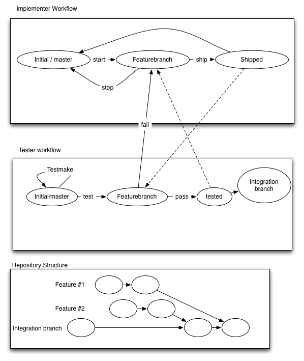

# Work.py
##FogBugz + GitHub = Win

work.py is a command-line tool that makes GitHub and FogBugz play nice together.  Let's face it, GitHub Issues suck and Using Kiln/Mercurial is for sissies.  work.py gives you the best of both worlds.  And we use it every day to ship our high-quality software.

What problems does work.py solve?

Basically, work.py makes all the things you know you should be doing practical.  You know you should be implementing each feature on its own branch.  You know you should be tracking time so you know how long you spent on Feature X.  You know you should be doing code reviews.  It's too much work to do these best practices for every change, so you won't.  **Work.py makes it easier to do best practices than not, so you do them every time.**

More specifically: 

* Every FogBugz case has its own branch.  Case 104 has branch work-104.  No more "do everything on master" workflow.
* With one command ("work start 104"), checkout the most up-to-date patch for issue #104, pull up the issue descrpition, and start tracking time.  Works across computers, so you can pair program.  Focus on working, not wrestling seventeen tools.
* We believe in code reviews, and especially in low barriers to reviewing **every patch**.  Most cases should be assigned a reviewer, whose job it is to accept or reject each patch.  With one command ("work test 104"), checkout the most up-to-date patch for issue #104, open up a GitHub compare view, and start your review.  Review time is tracked in EBS.  
* With one command ("work pass" or "work fail"), mark the ticket for integration or fail it back to the implementer for further work.
* With one command, ("work integrate 104"), find the appropriate branch to merge the patch into and perform the merge.  

Work.py is just a simple wrapper atop the appropriate git command-line and FB APIs.  So at any time you can drop down to the "real tools" to solve any problem.  Work.py is not a replacement for any tool, it's just some glue to keep you sane.

###How does this work exactly?

<table>
<tr><td>Fogbugz</td><td>Git</td></tr>
<tr><td>Case / ticket</td><td>Featurebranch (work-xxx)</td></tr>
<tr><td>Milestone</td><td>Integration branch (v1.2.0)</td></tr>
<tr><td>Project</td><td>Repository</td></tr>
</table>

And then you can look at this fancy chart!

###I'm not sold
Wait, there's more!  Here's a list of useful random things we've hacked in to work.py.

* Complain - complains about cases with no estimates or that have no time remaining on the clock.  Put it on a cron job, and you've got an automatic pointy-haired boss on a shoestring budget.
* integratemake, testmake - Magical glue to create integration and test cases
* network - shows the GitHub compare view for the project in the current working directory
* recharge - moves time charged to one case in FB to be charged to another instead
* ls - list open cases for the project in the current working directory (like FogBugz filters, but for the command line)

There are many more features in the works.

###Design flaws
Work.py is not going to be a good solution for you if you:

* Have more than one GitHub repo for a single project within your organization.  We use a single-repo workflow.
* Have a poor mapping of projects to repositories for whatever reason
* Don't want to use EBS, or put features on their own branches, or do code reviews, or other things we think are Really Good Ideas (TM).
* Really, really don't like sound effects when you merge.  It's a merge, it's supposed to be fun!
* Don't like our workflow for whatever reason (write your own darn project!)
* The documentation is lacking, as it was only ever intended to be an internal project.  Our made-up words may be a little confusing.  Just shoot us an e-mail or open a GitHub issue (yuck) and some friendly person will explain whatever nonsense we implemented.
* While we **love patches**, don't be terribly offended if we reject your Totally Awesome Workflow Modfiication if it impairs some important part of our workflow.  At the end of the day, we still have to use this thing in production, and so we're maintaining it for our developers first, and for everybody else second.  Don't take it personally.
* We do reserve the right to change it drastically.  There are cases filed for all sorts of weird and wonderful features that we really want that you may not be super happy about.  Oh well.

###Design strengths

* Work.py is battle-tested, production-quality software.  We've shipped something like 100k lines of application code using it, and we invoke it hundreds of times per day.  We love our baby.  
* Since everyone uses work.py here, just e-mail cases@drewcrawfordapps.com to get free code-level support from the guys who wrote it.  No kidding.
* It's a compact, maintainable script, weighing in at just over 1k lines.  You can probably extend it to support that weird edge case you want.

And if you've made it this far and are looking for contract iOS developers who care so much about code quality that we write our own workflow tools, consider us for your next project.